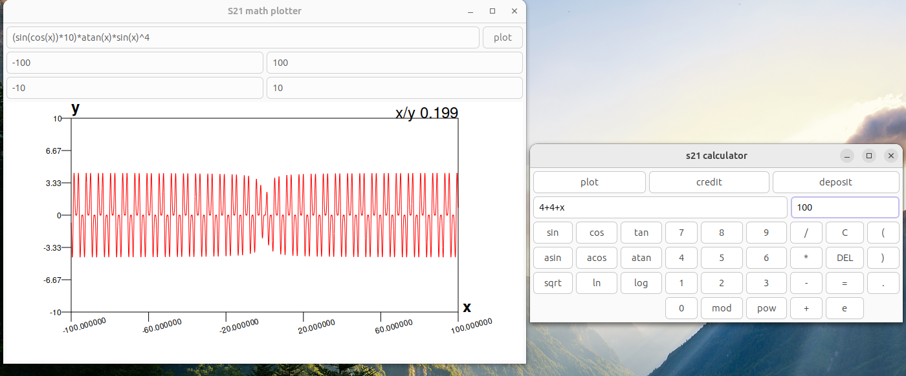

# CPP Calculator

Проект включает в себя:

* калькулятор с графическим интерфейсом;
* парсер математических выражений с поддержкой базовых операций;
* поддержку базовых математических функций;
* корректную обработку последовательности математических операций;
* возможность построения графика функции от переменной x;
* возможность изменения отображаемой области значения и определения функции.

## Зависимости
* С++ компилятор с поддержкой C++17
* gtkmm3.0

## Сборка
cd src
make calculator